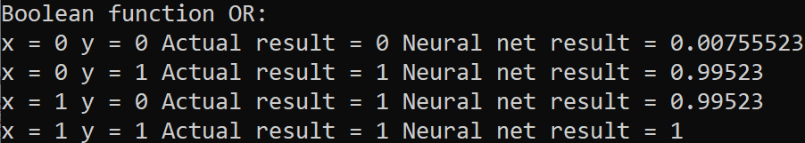
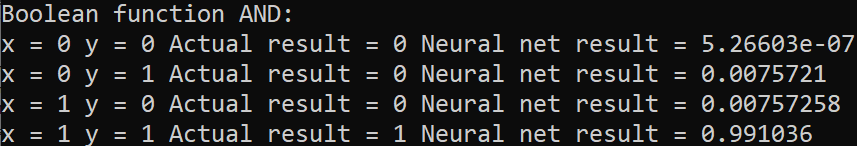
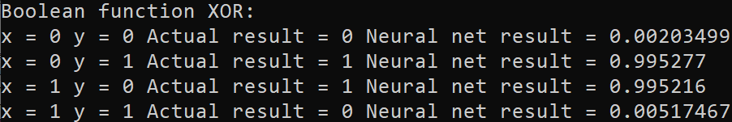

### Simple Feed-Forward Neural Network

**Description**

- **homework8_and_or.cpp** implements a feed-forward neural network that learns the boolean functions **AND** and **OR**. The neural network consists of two layers - an **input layer** of 2 **input neurons** and 1 so called **bias neuron** and an **output layer** which contains 1 **output neuron**

- **homework8_xor.cpp** implements a feed-forward neural network that learns the boolean function **XOR**. The neural network consists of 3 layers - an **input layer** of 2 **input neurons** and 1 **bias neuron**, a **hidden layer** of 4 **hidden neurons** and 1 **bias neuron** (the number of neurons in the **hidden layer** is adjustable through the constructor) and an **output layer** of 1 **output neuron**

**Hyperparameters**

- some of the **hyperparameters** (**learning_rate**, **max_epochs**) are hardcoded. You can change them and observe how the behaviour of the neural network changes

**Results**

- **OR** function

  - 

- **AND** function

  - 

- **XOR** function
  - 

**Comments**

- the neural networks seem to learn the functions pretty well
